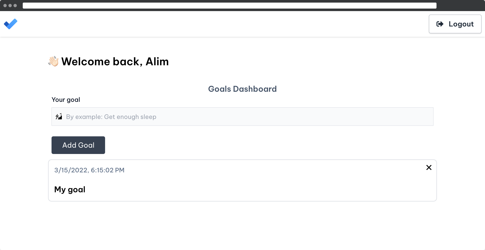

    ✨ Goal Tracker App (MERN)

---

### ✨ About:

An **MERN** app to record and track your goals

---

### ✨ Stack:

**✏️ Back-End:**

- [MongoDB](https://www.mongodb.com/) 💡
- [Express](https://expressjs.com/ru/) 💡
- [Mongoose](https://mongoosejs.com/) 💡
- [JSON Web Tokens](https://jwt.io/) 💡

**✏️ Front-End:**

- [React](https://ru.reactjs.org/) 💡
- [Redux](https://redux.js.org/) 💡
- [Axios](https://www.npmjs.com/package/axios) 💡
- [React-Toastify](https://github.com/fkhadra/react-toastify) 💡
- [React Router DOM](https://v5.reactrouter.com/web/guides/quick-start) 💡
- [React Icons](https://react-icons.github.io/react-icons/) 💡
- [Formik](https://formik.org/docs/overview) 💡
- [Yup](https://www.npmjs.com/package/yup) 💡
- [Tailwind CSS](https://tailwindcss.com/) 💡
- [Sass](https://sass-lang.com/) 💡